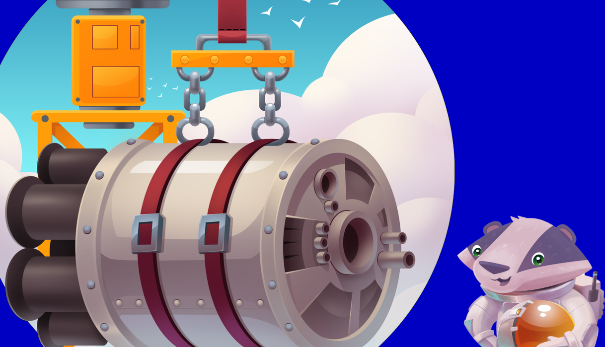

## Welcome to the Terraform on Azure Coding Challenge

Starting Monday, June 22, we're tuning in for [#HashiConf Digital](https://hashiconf.com/digital-june/) and we've engineered some **[#TerraformOnAzure](https://twitter.com/search?q=%23terraformonazure)** **Coding Challenges** for you 🚀. Every day of the week we'll  publish a new challenge and you'll have 24 hours to complete it. 

Everyday at 2PM CEST, a new challenge which will be posted on this page. You can help our little badger get their website up and running in the cloud!!

## How does it work? 🧰

This week (June 22-26), while HashiConf Digital takes place, we're releasing a **daily #TerraformOnAzure coding challenge**. You have **24 hours** to submit your coding challenge solution, before we will publish ours in this repo.

Of course, you're free to continue to work longer on your coding challenge and still it! We want to learn from you as well! The goal is for everyone to learn and expore.

Join, and claim your exclusive space-themed gift 🎁!

## What's this spacy badger doing here?

Our [Azure Heroes](https://aka.ms/azure.heroes?ocid=aid3015373_ThankYou_DevComm&eventId=HashiConfTerraformonAzure_JK1-K2-hoArJ) badger has a startup idea that is out of this world! For their interstellar delivery service, they need your help developing an app leveraging the best of [Terraform](https://terraform.io), [Azure](https://azure.com), and Azure managed Kubernetes. Help them deploy their application, so they can concentrate on the quality of their galactic snacks.

*Are you ready to show off your Terraform and Azure skills to send our astronaut badger into space?*

## This day's challenge
**Watch**  the [day 2 video](https://aka.ms/tfonazure/vid/day2) to see how our Badger is progressing with the space business!


**Start your engines** and head over to [Challenge 2](https://github.com/Terraform-On-Azure-Workshop/terraform-azure-hashiconf2020/blob/main/challenges/challenge2/Readme.md)

## Challenges 💻

| Date | Challenge | Description | Video |
| ---- | --------- | ----------- |
| June 22, 2020 | [Challenge 1](https://github.com/Terraform-On-Azure-Workshop/terraform-azure-hashiconf2020/blob/main/challenges/challenge1/Readme.md) | Hosting a website on Azure App Service | [day1](https://aka.ms/tfonazure/vid/day1) |
| June 23, 2020 | [Challenge 2](https://github.com/Terraform-On-Azure-Workshop/terraform-azure-hashiconf2020/blob/main/challenges/challenge2/Readme.md) | Hosting the application databases on Azure | [day2](https://aka.ms/tfonazure/vid/day2) |
| June 24, 2020 | TBA | TBA | TBA |
| June 25, 2020 | TBA | TBA | TBA |
| June 26, 2020 | TBA | TBA | TBA |

## What else can I do?

Thanks for asking! **Follow** the [#TerraformOnAzure](https://twitter.com/search?q=%23terraformonazure) Twitter hashtag, bookmark this page, and/or have a look at our [documentation](https://docs.microsoft.com/en-us/azure/developer/terraform/?ocid=aid3015373_ThankYou_DevComm&eventId=HashiConfTerraformonAzure_JK1-K2-hoArJ).
